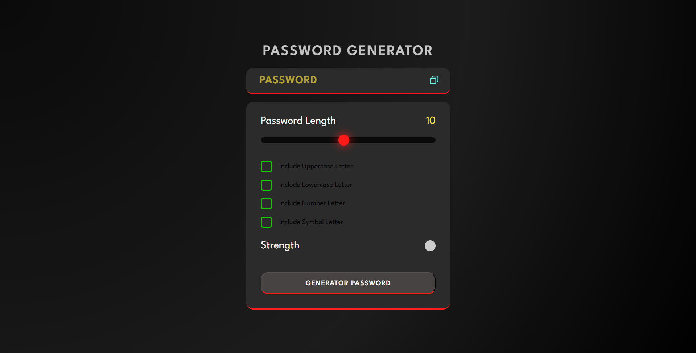

# 🔐 Password Generator Web Application

A modern, secure, and user-friendly **Password Generator** built using core web technologies.  
This project allows users to generate strong, random, and customizable passwords for enhanced digital security.

The application focuses on **simplicity, security, performance, and usability**, making it ideal for both real-world use and learning purposes.

---

## 📖 Project Overview

In today’s digital world, weak passwords are one of the biggest security risks.  
This project solves that problem by providing a tool that can generate **strong, unpredictable, and secure passwords** based on user-selected criteria.

The project is designed as a **learning-focused application** that demonstrates:
- Core JavaScript logic
- Randomization algorithms
- DOM manipulation
- User interaction handling
- Clean UI design
- Real-world problem solving

This project is perfect for:
- Students learning JavaScript
- Beginners in frontend development
- Cybersecurity awareness
- Portfolio projects
- Interview demonstrations

---

## 🚀 Features

### 🔑 Password Generation
- Random password creation using secure logic
- Fully customizable password structure
- High entropy password generation

### 🎛 Customization Options
- Password length selector
- Include uppercase letters (A–Z)
- Include lowercase letters (a–z)
- Include numbers (0–9)
- Include special characters (!@#$%^&*)

### 📋 Usability Features
- One-click copy to clipboard
- Instant password regeneration
- Real-time UI updates
- Clear and simple controls
- User-friendly layout

### ⚡ Performance
- Lightweight application
- Fast execution
- No external dependencies
- Runs fully in the browser
- Offline usable

---

## 🛠️ Tech Stack

| Technology | Purpose |
|------|--------|
| HTML5 | Structure and layout |
| CSS3 | Styling and UI design |
| JavaScript (ES6) | Logic, randomization, DOM handling |

---

## 📸 Project Preview

